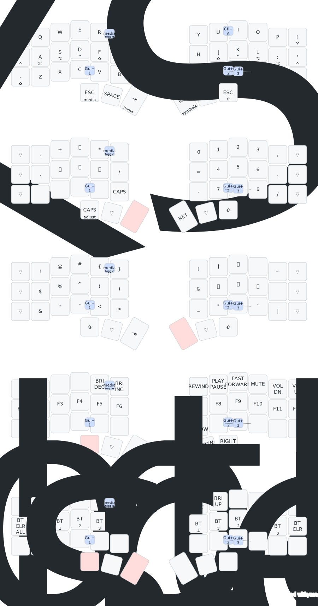

# ZMK Firmware for Dao keyboard

This is a repository for a ZMK Firmware for both Dao42 and Dao44 keyboards.

* [main](https://github.com/yumagulovrn/dao-zmk-config/tree/main) branch is for Dao42
* [dao44](https://github.com/yumagulovrn/dao-zmk-config/tree/dao44) branch is, obviously, for Dao44

## Keymap

NB: this gets regenerated on every update to `dao.keymap` file (see workflows).
You can also view the the keysmaps online: [DAO's layout @ keymap-drawer](https://keymap-drawer.streamlit.app/?zmk_url=https%3A%2F%2Fgithub.com%2Ffarazdagi%2Fdao-zmk-config%2Fblob%2Fmain%2Fconfig%2Fboards%2Farm%2Fdao%2Fdao.keymap&layout={%22qmk_keyboard%22:%20%22corne_rotated%22,%20%22qmk_layout%22:%20%22LAYOUT_split_3x6_3%22}).

The `keymap-drawer` application allows to call it by URL. However, normally layout of ZMK keymap file
is not recognized correctly. So, you need to pass in `layout` URI param, i.e. 
`layout={"qmk_keyboard": "corne_rotated", "qmk_layout": "LAYOUT_split_3x6_3"}`

## Hints

### How to change the keymap?

1. Make changes to the [dao.keymap](../config/boards/arm/dao/dao.keymap) file, via wonderful 0 [keymap-editor](https://nickcoutsos.github.io/keymap-editor/)
1. Commit changes to your repository
1. Go to `Actions` tab in your repository
1. Wait for the GitHub Action to complete
1. Grab `firmware.zip` file - it contains firmware for both of your halves

### How to flash the keyboard?

1. Obtain `firmware.zip`
2. Unzip `firmware.zip` - you should have `dao_left.uf2` and `dao_right.uf2` files
3. Turn off the power for selected halve (move slider to position `OFF`)
4. Connect selected halve to the PC via USB-C cable
5. Press `RESET` button **twice** to enter DFU mode - you should see new USB device in your file manager
6. Copy the corresponding firmware to the root directory of the new USB device
7. Disconnect selected halve from the PC
8. Repeat steps 3-7 for the other halve

### How to pair halves?

1. Turn off the power for both halves (move slider to position `OFF`)
2. Turn on the power for both halves (move slider to position `ON`)
3. Press `RESET` button **once** on both halves **simultaneously**

### What can I configure?

See the extensive docs: https://zmk.dev/docs/codes

